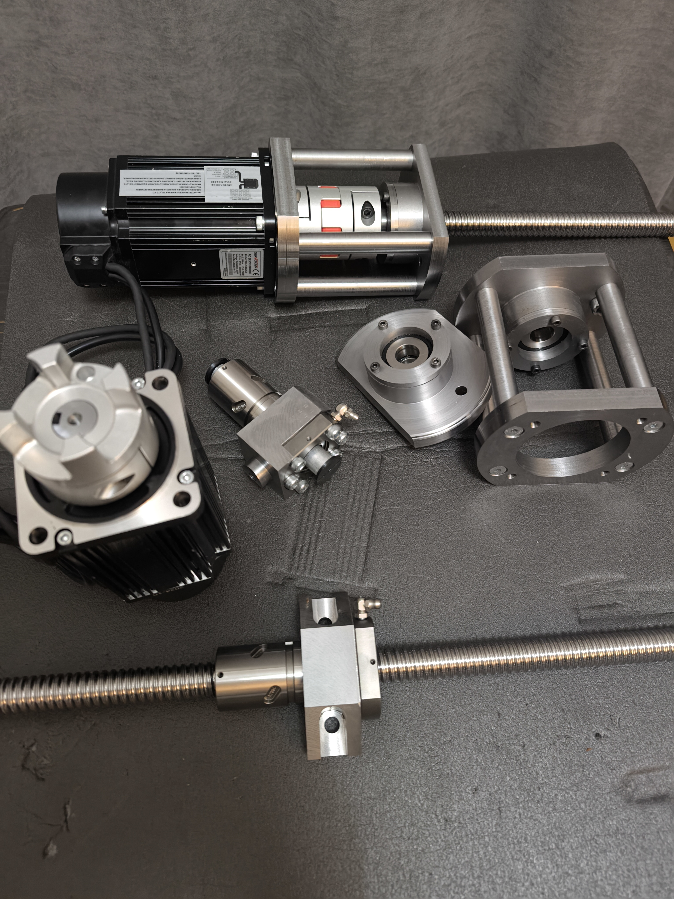
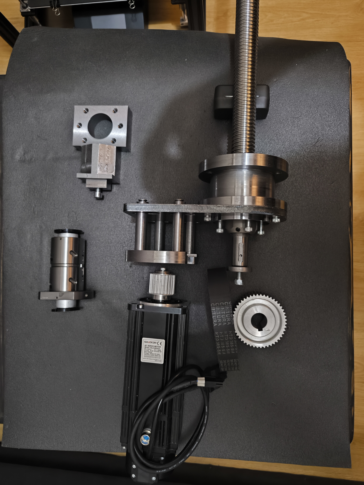

# CNC Milling Machine - Mechanical Components

## Ball Screws and Ball Nuts (Vidalı Miller ve Somunlar)
- X Axis: GTEN 2005 Ball Screw + GTEN Double Nut Ball Screw
- Y Axis: GTEN 2005 Ball Screw + GTEN Double Nut Ball Screw
- Z Axis: GTEN 3205 Ball Screw + GTEN Double Nut Ball Screw

## Bearings (Rulmanlar)
- X Axis: 2 × BR ZKLN1747-2RS Axial Angular Contact Ball Bearings
- Y Axis: BR ZKLN1747-2RS Axial Angular Contact Ball Bearing
- Z Axis: BR ZKLF2575-2RS Axial Angular Contact Ball Bearing

## Servo Motors and Drives (Servo Motorlar ve Sürücüler)
- X Axis: 0.75 kW LZ3A Servo Motor & Drive Set
- Y Axis: 0.75 kW LZ3A Servo Motor & Drive Set
- Z Axis: 1.0 kW LZ3A Servo Motor & Drive Set

## Position Sensors (Konum Sensörleri)
- 3 × Omron Distance Sensors (X, Y, and Z Axes)

## Couplings (Kaplin)
- 3 × Kulkarni GS24 Couplings

